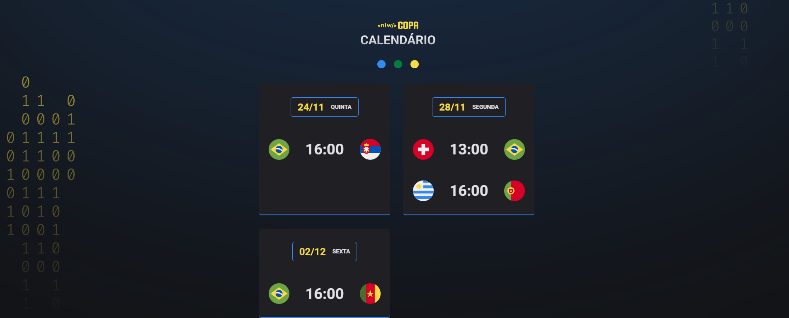
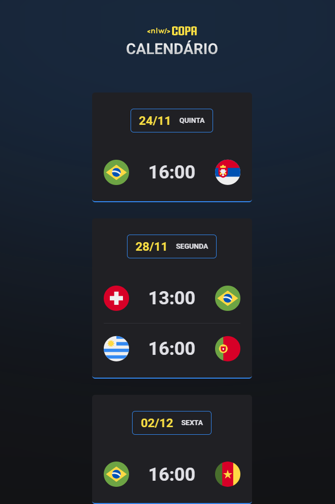

<h1 align="center"> ⚽ NLW Personal World Cup Calendar</h1>

Exclusive event promoted by Rocketseat for web technologies.

  <a href="#-tecnologias">Technologies</a>&nbsp;&nbsp;&nbsp;|&nbsp;&nbsp;&nbsp;
  <a href="#-projeto">Project</a>&nbsp;&nbsp;&nbsp;|&nbsp;&nbsp;&nbsp;
  <a href="#-layout">Layout</a>&nbsp;&nbsp;&nbsp;|&nbsp;&nbsp;&nbsp;
  <a href="#memo-licença">Licença</a>

  

 

## 🚀 Technologies

- HTML e CSS
- JavaScript
- Git, github

## 💻 Project

Responsive design for desktop and mobile.

Event promoted by Rocketseat learning platform to engage the community and create a personal calendar for the World Cup games

## 🔖 Layout

The layout for this project its on figma [HERE](https://www.figma.com/file/gpqavL469k0pPUGOmAQEM9/Explorer-Lab-%2301/duplicate).
